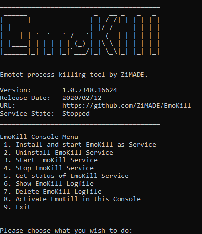
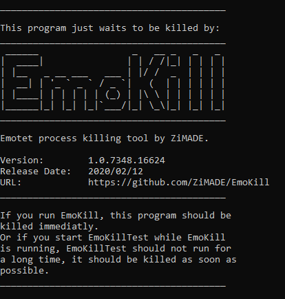

# EmoKill -> Avoid wasting time after detection of Emotet !!!

EmoKill is an Emotet process detection and killing tool for Windows OS.  
It avoids wasting time after detection of Emotet. Any process that matches the pattern of Emotet based on the logic of [EmoCheck by JPCERT/CC](https://github.com/JPCERTCC/EmoCheck) will be detected by EmoKill and killed as soon as possible.

## How to use

1. Download EmoKill.zip from the Releases page.
2. Unpack the downloaded zip-file on your host.
3. Install EmoKill as a windows service (Easiest way is to use `EmoKillConsole.exe`).

## Download

Please download from the [Releases](https://github.com/ZiMADE/EmoKill/releases) page.

Latest hash:  

> EmoKill.exe  
>   MD5   : 07261DAA0D7673F7F65D422E3944224E  
>   SHA1  : 5F58AFD7A7EC9877576232ACFAEC058A46843878  
>   SHA256: 86B13205DF5AF154E99631C728CCD7C4B6846DE7737CE7B471FAAC3DD7C06E79  

> EmoKillConsole.exe  
>   MD5   : E652FA0AB3782CCF58D595BAEB075B9F  
>   SHA1  : 9068315EBC395EBE676675716DB7259609AE281A  
>   SHA256: 72E4B52B8DCC62C393659B6B5909E357E7B9E2F6F512EA78B64DAB76776F42E2  

> EmoKillTest.exe  
>   MD5   : EDFD65A922B324CB824C587EF5711638  
>   SHA1  : 3EC7D9D8027DAF825DC71F3B0471126AB13E0474  
>   SHA256: 7D28FB9FBF664390EB992F817E63D256F71C0ECC22D71C836F6B8D4B03D9CBF7  

## How EmoKill works

The package of EmoKill consists of 3 program files: 
#### EmoKill.exe
- This is the main part of EmoKill, it runs as a windows service and contains the whole logic to detect and kill processes of Emotet.  
#### EmoKillConsole.exe
- EmoKillConsole has a small menu that helps even inexperienced users to start.
#### EmoKillTest.exe
- To see EmoKill in action without having an Emotet infection, this exe will be helpfull.

When EmoKill starts, there will be made a check of all running processes on your machine. After that every new started process will also be checked by EmoKill. Any process that matches the pattern of Emotet based on the logic of [EmoCheck v0.0.2 by JPCERT/CC](https://github.com/JPCERTCC/EmoCheck) will be detected by EmoKill and killed as soon as possible. The time between detection and successful killing such a process is normaly less than 1 second.

Detection and killing of Emotet processes are logged to a logfile `%windir%\Temp\EmoKill.log` and also to the application eventlog.

After a reboot of your machine the installed EmoKill service will start again automaticly.

## Installation

1. Start `EmoKillConsole.exe` (run as amdinistrator is required)
2. Select menuitem 1 (Install and start EmoKill as Service)

Selecting the installation of the EmoKill as a windows service will do follwoing: 
1. program files are copied to the program files folder on your systemdrive
2. after that the service will be installed with installutils.exe of the .NET-Framework
3. and than the EmoKill service will be startet

That's all, EmoKill should be ready to detect and kill processes of Emotet.

## Testing

You may use `EmoKillTest.exe` to check and see how is EmoKill working on your machine. 

#### Scenario 1: 
1. Stop EmoKill service if the service is running (i.e. menuitem 4 of `EmoKillConsole.exe`)
2. Start `EmoKillTest.exe` one or more times
3. Start EmoKill service (i.e. menuitem 3 of `EmoKillConsole.exe`)
4. All startet instances of `EmoKillTest.exe` should be killed in a few seconds

#### Scenario 2: 
1. Start the EmoKill service if the service is not running (i.e. menuitem 3 of `EmoKillConsole.exe`)
2. Start `EmoKillTest.exe` one or more times
3. All startet instances of `EmoKillTest.exe` should be killed in a few seconds

After Testing have a look to the application eventlog and/or to the logfile (i.e. menuitem 6 of `EmoKillConsole.exe`).

## Why EmoKill needs Administrator Privileges?

EmoKill can only work correctly if the program runs with administrator privileges. This is necessary because  EmoKill will be informed by the operating system about the creation of new windows processes. Without Administrator Privileges this is not possible! 

## Can you trust EmoKill? YES!!!

Why should you trust EmoKill?
- EmoKill does only watch for windows processes and kills processes which match the pattern of Emotet as soon as possible!
- EmoKill is open source!
  - many developers can check the code of EmoKill
  - it's also possible for developers to decompile all components of EmoKill
- EmoKill runs only on the machine where it is installed!
- EmoKill needs no network connection!
- EmoKill needs no connection to the internet!
- EmoKill contains no ads, no malware, ..., and no third party components!

## How EmoKill detects Emotet

(v1.0.7348.26967)  

Detection of Emotet is also part of EmoKill and is based on the C++ code of [EmoCheck v0.0.2 by JPCERT/CC](https://github.com/JPCERTCC/EmoCheck), thanks for it.

## Screenshot

 

## Releases

- (Feb. 13, 2020) v1.0.7348.26967
  - Initial release

### Tested environments

- Windows 10 1909 64bit German/English Edition
- Windows 10 1903 64bit German/English Edition
- Windows 10 1607 Enterprise 206 LTSB 64bit German/English Edition
- Windows 7 SP1 32bit German/English Edition
- Windows 7 SP1 64bit German/English Edition

### Build

- Windows 10 1909 64bit German Edition
- Microsoft Visual Studio Community 2017
